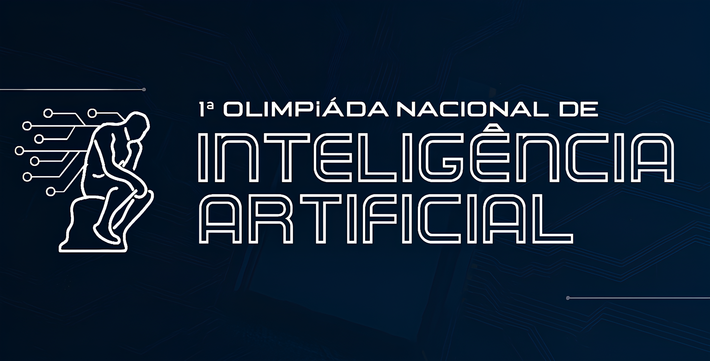
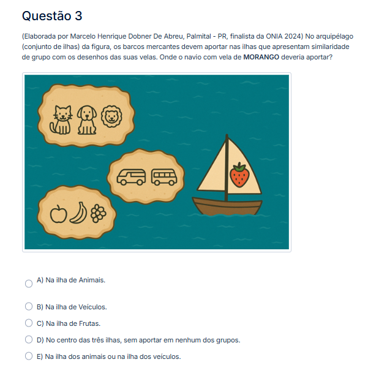
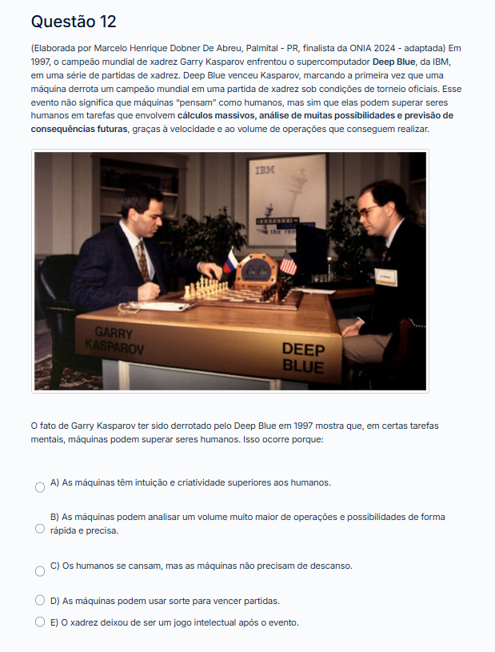
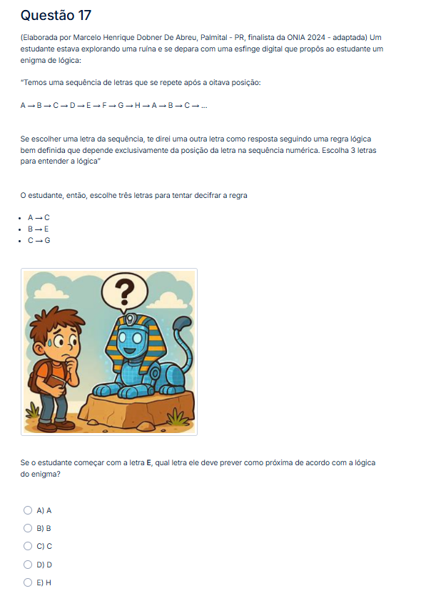

# **Questões para a Olimpíada Nacional de Inteligência Artificial (ONIA) 2025/2026** 🧠

- *By: Marcelo Abreu*
- *Medalhista de Prata, (ONIA 2024/2025)*
- *Colaborador Pedagógico (ONIA 2025/2026)*
  
> "<b>And it feels like yesterday was a year ago...</b>" - 🎵

---

## **Sumário**
- [Abstract](#abstract)
- [1. Introdução](#1-introdução)
- [2. Escopo Estratégico da Contribuição](#2-escopo-estratégico-da-contribuição)
- [3. Framework de Design e Validação de Itens](#3-framework-de-design-e-validação-de-itens)
- [4. Reconhecimento Oficial & Validação Institucional](#4-reconhecimento-oficial-e-validação-institucional)
- [5. Metodologia e Framework Pedagógico](#5-metodologia-e-framework-pedagógico)
- [6. Outros Projetos Relevantes](#6-outros-projetos-relevantes)
- [7. Conclusão](#7-conclusão)
- [8. Contato](#8-contato)

---

## **Abstract**

Este relatório técnico documenta o projeto de desenvolvimento e validação de um banco de itens de avaliação para a 2ª edição da Olimpíada Nacional de Inteligência Artificial (ONIA 2025). 

**Objetivo:**  Criar e testar questões visuais e conceituais para avaliar competências de pensamento crítico e raciocínio em IA, dirigidas a estudantes do ensino básico e médio.

**Metodologia:** Seguiu-se um processo prático de trabalho em etapas: escolha dos temas com base no programa da olimpíada, desenho dos enunciados e estímulos visuais, revisão por pares e ajustes até a versão final. A prioridade foi tornar as questões claras, visuais e fáceis de interpretar sem exigir conhecimento prévio.

**Resultados:** Foram elaborados diversos itens de avaliação. Três questões foram aprovadas pela comissão organizadora e integradas à prova oficial da 1ª Fase da ONIA 2025, cobrindo raciocínio visual, análise histórica e problemas de sequência lógica.

**Conclusão:** O procedimento adotado provou ser eficiente para produzir itens coerentes e utilizáveis em prova. O processo é simples de replicar e oferece base prática para futuras contribuições ao programa de avaliação em IA.

---

## **1. Introdução**

Este repositório serve como a documentação técnica e o portfólio da minha contribuição como colaborador pedagógico para a Olimpíada Nacional de Inteligência Artificial (ONIA 2025/2026). Após obter a **medalha de prata** na edição inaugural de 2024/2025, fui convidado a integrar o desenvolvimento de conteúdo avaliativo, resultando na criação de um banco de questões. 

O propósito deste documento é formalizar o processo de concepção, a fundamentação teórica e a validação desses instrumentos de avaliação, alinhando-os à missão da ONIA de promover o letramento em IA no Brasil sob uma ótica de rigor técnico e cognitivo.

---

## **2. Escopo Estratégico da Contribuição**

A ONIA é uma iniciativa estratégica para a popularização da IA e o desenvolvimento de competências digitais e cognitivas. Minha contribuição para o ciclo de 2025/2026 consistiu no desenvolvimento e submissão de um conjunto de itens de avaliação com foco em quatro domínios principais:

- **Análise Ética e Sociotécnica:** Vieses algorítmicos, privacidade e automação.
- **História e Epistemologia da IA:** Marcos conceituais e tecnológicos.
- **Fundamentos Técnicos:** Lógica computacional, Machine Learning e Redes Neurais.
- **Raciocínio Crítico e Visual:** Resolução de problemas abstratos por meio de estímulos visuais.

Deste portfólio de trabalho, 3 questões foram oficialmente selecionadas e publicadas na prova nacional da 1ª Fase, com o devido crédito de autoria, validando a eficácia desta abordagem pedagógica multifacetada.

---

## **3. Framework de Design e Validação de Itens**

A criação dos itens seguiu um processo sistemático, estruturado em quatro fases, visando garantir a validade de conteúdo e o alinhamento pedagógico.

1.  **Análise de Domínio e Decomposição de Competências:** Definição dos construtos a serem avaliados com base no syllabus oficial da ONIA e em frameworks de referência (AI4K12, UNESCO AI Competency Framework), decompondo competências complexas em objetivos de aprendizagem mensuráveis.
2.  **Construção de Ontologias Conceituais:** Mapeamento das relações semânticas entre os conceitos-chave de IA para identificar pontos nodais para a avaliação e garantir a progressão lógica da dificuldade.
3.  **Prototipagem de Estímulos e Engenharia Cognitiva:** Desenvolvimento de artefatos visuais (tirinhas, diagramas, metáforas gráficas) projetados para minimizar a carga cognitiva extrínseca e maximizar a carga pertinente, conforme a Teoria da Carga Cognitiva.
4.  **Validação de Conteúdo por Pares Especialistas:** Submissão formal dos itens ao comitê organizador da ONIA para revisão de clareza, precisão técnica e adequação pedagógica.

---

## **4. Reconhecimento Oficial e Validação Institucional**

A eficácia do trabalho foi validada pela Comissão Organizadora da ONIA com a seleção e publicação de **três questões de minha autoria** na prova nacional da 1ª Fase de 2025. O crédito autoral foi explicitamente atribuído no material oficial.

Adicionalmente, em comunicação direta, com a comissão organizadora confirmou o interesse na utilização de outras questões do meu portfólio em fases subsequentes da competição tão como na próxima edição, solidificando o status deste banco de questões como um ativo de longo prazo para a Olimpíada.

Os itens selecionados foram publicados na 1ª Fase da ONIA 2025/2026. A tabela abaixo detalha sua função avaliativa específica.

  
| Questão | Tema Central | Tipo de Raciocínio | Prova Oficial |
|:--------|:-------------|:-------------------|:------------------|
| **3** | Embeddings de Conceitos | Lógico-visual | 

Ver Prova

 |
| **12** | História da IA (Deep Blue vs. Kasparov) | Histórico-analítico | 

Ver Prova

 |
| **17** | Raciocínio Sequencial Lógico | Cognitivo-abstrato | 

Ver Prova

 | 

---

## **5. Metodologia e Framework Pedagógico**

O desenvolvimento dos itens foi guiado por uma metodologia de **Engenharia Pedagógica**, focada em avaliar competências de ordem superior nos seguintes domínios:
-   **Análise Ética e Sociotécnica**
-   **Raciocínio Histórico-Conceitual**
-   **Intuição sobre Fundamentos Técnicos**
-   **Abstração e Resolução de Problemas Visuais**

<b>Clique para ver o Framework de Design e a Fundamentação Teórica Detalhada</b>

### 5.1. Framework de Design e Validação de Itens (FDVI)
A criação dos itens seguiu um processo sistemático, estruturado em quatro fases:
1.  **Análise de Domínio:** Definição dos construtos a serem avaliados com base no syllabus oficial da ONIA e em frameworks de referência (AI4K12, UNESCO).
2.  **Construção de Ontologias Conceituais:** Mapeamento das relações semânticas entre os conceitos-chave de IA para garantir a progressão lógica da dificuldade.
3.  **Prototipagem de Estímulos e Engenharia Cognitiva:** Desenvolvimento de artefatos visuais (tirinhas, diagramas) para minimizar a carga cognitiva extrínseca e maximizar a carga pertinente (Teoria da Carga Cognitiva de Sweller).
4.  **Validação de Conteúdo por Pares:** Submissão formal dos itens ao comitê organizador da ONIA para revisão de clareza, precisão técnica e adequação pedagógica.

### 5.2. Fundamentos Teórico-Pedagógicos
O design de cada item foi ancorado em três princípios teóricos:
- **Visualização Estrutural:** Uso de elementos visuais como "andaime" cognitivo (scaffolding), conforme proposto por Bruner.
- **Cognição Situada:** Ancoragem dos problemas em contextos realistas para promover a transferência de conhecimento.
- **Construtivismo:** Design de itens que exigem a integração de múltiplos processos cognitivos (observação, dedução, generalização), em alinhamento com a visão de Piaget.

### 5.3. Princípios de Validação e Psicometria
A qualidade foi balizada pela Taxonomia de Bloom Revisada (Anderson & Krathwohl, 2001), com prioridade para os níveis cognitivos superiores: **Analisar (C4)**, **Avaliar (C5)** e **Criar (C6)**. Como desiderata psicométrica, os itens foram projetados para alto poder de discriminação, com a validação empírica (TCT/TRI) sendo um passo futuro.

> **Nota de Confidencialidade:** Conforme orientação da Comissão Organizadora, as outras questões não publicadas do banco de trabalho permanecem sob sigilo para preservar a integridade acadêmica das futuras fases e edições da ONIA.

---

## **6. Outros Projetos Relevantes**

### Projeto de Machine Learning (3ª FASE – ONIA 2024/2025)
A base técnica para o design conceitual das questões foi consolidada no desenvolvimento de um modelo preditivo durante a fase final da ONIA 2024, onde apliquei técnicas de *feature engineering* e regressão.

[**→ Acessar Análise Técnica Completa no Repositório Dedicado**](https://github.com/Marcelo-Abreeu/Machine-Learning)

---

## **7. Conclusão**

Este projeto demonstrou com sucesso a viabilidade de um modelo de engenharia pedagógica para a criação de itens de avaliação em IA, sintetizando rigor técnico, teoria cognitiva e design instrucional.

**O resultado é um banco de questões validado institucionalmente pela ONIA, com 3 itens publicados na prova nacional de 2025/2026 e um portfólio remanescente provisionado para uso em fases e edições futuras, conforme confirmado pela comissão organizadora.**

Em um nível pessoal, o trabalho consolida minha transição de competidor premiado a colaborador ativo no ecossistema de educação em IA, aplicando a experiência prática para o desenvolvimento da comunidade. Este estudo de caso serve, portanto, como um modelo replicável para futuras contribuições e para a inovação contínua no campo da avaliação de competências tecnológicas no Brasil.

---

## **8. Contato**

